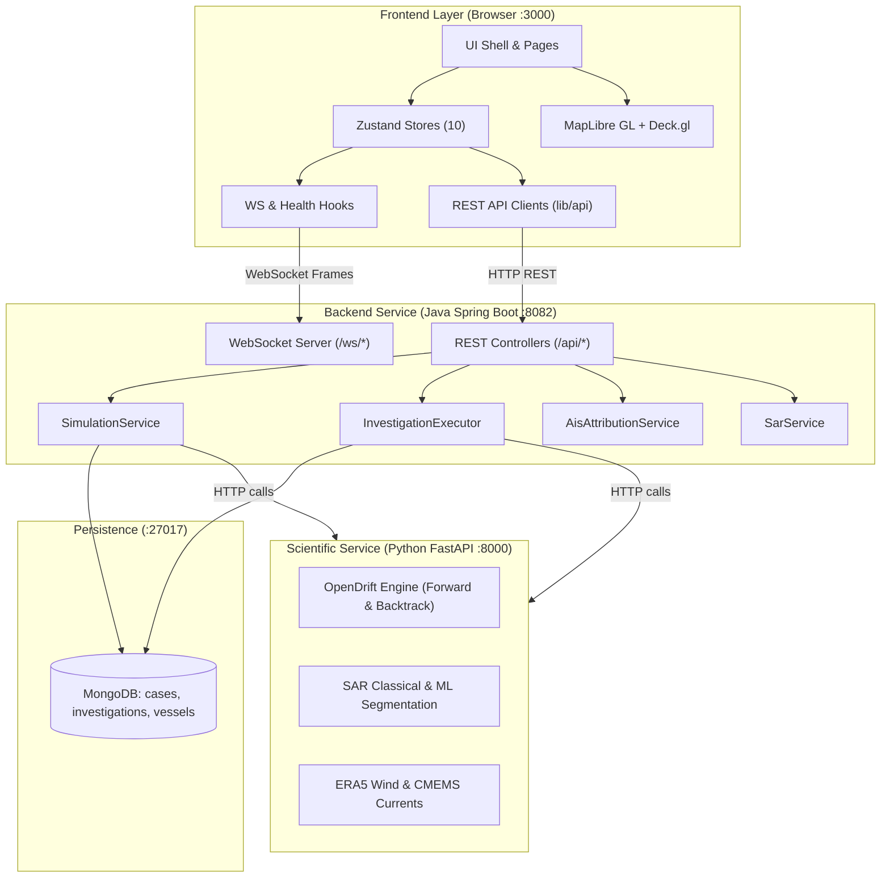

# OilGuard Architecture Map

Generated during Milestone M0 Audit using Graphify knowledge graph extraction and code audit.

---

## 1. System Topology & Service Boundaries



### Boundary Contracts:
1. **Frontend to Backend REST (`http://localhost:8082/api/*`)**:
   - JSON REST API over Spring Boot controllers.
   - Handled uniformly via `lib/http.ts` (`apiBase = '/api'`).
2. **Frontend to Backend WebSocket (`ws://localhost:8082/ws/*`)**:
   - Topics: `/ws/simulation/{id}` and `/ws/investigation/{id}`.
   - Handled via `lib/ws/client.ts` (`SocketClient`).
3. **Backend to Scientific Service (`http://localhost:8000`)**:
   - Internal microservice communications (Python OpenDrift, SAR inference, ERA5/CMEMS environmental grids). Frontend never calls the scientific service directly.
4. **Backend to Database**:
   - MongoDB instance running on port 27017 storing persistent investigations, simulations, and telemetry.

---

## 2. Graphify Knowledge Graph Insights

The codebase extraction was performed across 254 source files:
- **Total Entities (Nodes):** 3,297
- **Total Relationships (Edges):** 8,829
- **Detected Communities:** 121
- **Top God Nodes (Central System Abstractions):**
  1. `Investigation` (93 edges) – Root state machine orchestrating forensic workflow.
  2. `InvestigationExecutor` (76 edges) – Backend engine sequencing the 8 stages.
  3. `BacktrackingResult` (66 edges) – Inverse drift ensemble and origin probability distribution.
  4. `AttributionRun` (65 edges) – Multi-factor candidate scoring and ranking result.
  5. `SimulationEvent` (62 edges) – Real-time event propagation across simulation lifecycle.
  6. `InvestigationService` (58 edges) – Backend boundary for investigation CRUD and persistence.
  7. `SarObservation` (56 edges) – Satellite SAR detection, slick polygons, and footprint metadata.
  8. `useInvestigationStore` (56 edges) – Primary frontend investigation state coordinator.
  9. `InvestigationStage` (55 edges) – Stage lifecycle definition (pending, running, completed, failed).
  10. `useSimulationStore` (54 edges) – Frontend coordinator for vessels, trails, and drift.

---

## 3. Frontend Architecture Decomposition

### 3.1 Routing & Shell Architecture
```
App.tsx
└── Layout.tsx
    ├── SecondaryPageHeader (subpages)
    ├── Command Spine (desktop left rail: CC, SIM, INV, BCK, ATR, REP)
    │   ├── Brand Emblem
    │   ├── NavItem Group
    │   ├── UtcSpineClock (Z-time readout)
    │   └── SpineHealthMonitor (API / DB / Python live dots)
    └── <main> (Workspace / Theater viewport)
        ├── /              -> CommandCenter.tsx
        ├── /simulation    -> Simulation.tsx
        ├── /investigation -> Investigation.tsx
        ├── /backtracking  -> Backtracking.tsx
        ├── /attribution   -> Attribution.tsx
        └── /report        -> Report.tsx
```

### 3.2 State Management (`src/store/`)
The frontend uses Zustand stores with strict domain partitioning:

| Store File | Store Identifier | State Responsibility |
|---|---|---|
| `simulationStore.ts` | `useSimulationStore` | Simulation ID, status, clock, selected vessel, vessel fleet list, live position trails (`TrailMap`), spill event details, forward drift particles & extent. |
| `investigationStore.ts` | `useInvestigationStore` | Active investigation ID, status, progress %, 8 sequential stages, params, conclusion state, evidence chain array, ground-truth reveal comparison, focused stage. |
| `featureStores.ts` | `useBacktrackingStore` | Backtracking run ID, status, estimated origin `{lat, lon}`, time window, uncertainty (km), source confidence contours, trajectory paths, ensemble stats. |
| `featureStores.ts` | `useAttributionStore` | Attribution run ID, status, candidate vessels ranked list, 5-factor score breakdown, AIS query metadata, provider status. |
| `featureStores.ts` | `useGroundTruthStore` | Dev/evaluation ground truth unlock and reveal origin. |
| `featureStores.ts` | `useReportStore` | Dossier generation flag. |
| `mapStore.ts` | `useMapStore` | Viewport camera (`MapViewState`), catalogue layer visibility (`Record<MapLayerId, boolean>`), active selection (`MapSelection`), cursor lat/lon, fitBounds requests. |
| `sarStore.ts` | `useSarStore` | Sentinel-1 observation status, satellite metadata, scene footprint polygon, detected slick candidates (`SarCandidateState[]`). |
| `connectionStore.ts` | `useConnectionStore` | Live health state for `api`, `websocket`, `mongo`, `python` services. |
| `environmentStore.ts` | `useEnvironmentStore` | Data source availability for ERA5 wind and CMEMS currents. |
| `incidentStore.ts` | `useIncidentStore` | Spill incident observation state, confidence, and area. |

### 3.3 Hooks Layer (`src/hooks/`)
- `useHealthProbe.ts`: Background interval (15s) checking `GET /api/health` and Python ping; updates `useConnectionStore`.
- `useSimulationConnection.ts`: Subscribes to `/ws/simulation/{id}`, handles socket lifecycle and routes incoming messages to `simulationStore`, `sarStore`, `backtrackingStore`, and `attributionStore`.
- `useInvestigationConnection.ts`: Subscribes to `/ws/investigation/{id}`, dispatches frames to `investigationStore`, and triggers full re-hydration via `GET /api/investigation/{id}` on reconnect.

### 3.4 API Clients Layer (`src/lib/api/`)
REST communication with backend over fetch (`lib/http.ts`):
- `healthApi.ts`: `getHealth()`, `getPythonPing()`
- `simulationApi.ts`: `createSimulation()`, `startSimulation()`, `advanceClock()`, `releaseSpill()`, `runForwardDrift()`
- `vesselApi.ts`: `list()`, `moveVessel()`, `getVessel()`
- `investigationApi.ts`: `start()`, `get()`, `list()`, `retry()`, `cancel()`, `reveal()`
- `sarApi.ts`: `detect()`, `list()`
- `backtrackApi.ts`: `run()`, `list()`
- `attributionApi.ts`: `run()`, `list()`, `providers()`
- `environmentApi.ts`: `getEnvironment()`
- `incidentApi.ts`: `list()`

### 3.5 WebSocket Layer (`src/lib/ws/`)
- **Transport**: Native WebSocket client (`SocketClient`) with automatic exponential backoff reconnection.
- **Topics**:
  - `/ws/simulation/{simulationId}`
  - `/ws/investigation/{investigationId}`
- **Events**:
  - Simulation: `clock_update`, `vessel_moved`, `spill_released`, `oil_particles`, `forward_drift.started`, `forward_drift.completed`, `forward_drift.failed`
  - Investigation: `investigation_started`, `step_complete`, `origin_estimated`, `vessels_ranked`, `investigation_complete`, `investigation_failed`, `investigation_cancelled`, `groundtruth.revealed`
  - Observation & Analysis: `sar_observation.*`, `backtracking.*`, `ais_search.*`, `vessels_filtered`, `attribution.*`, `vessel_scores_ready`

### 3.6 Map & Geospatial Layer Architecture
Map rendering is composed via **MapLibre GL** for base bathymetric vector tiles and **Deck.gl** (via `@deck.gl/mapbox` `MapboxOverlay`) for hardware-accelerated vector and particle layers.

#### Logical Layer Registry (`MapLayerId`):
1. `satellite`: Satellite reference imagery
2. `slick`: Observed spill point
3. `vessels`: Vessel fleet markers
4. `vesselTrails`: Recorded vessel historical paths
5. `wind`: ERA5 wind vector field
6. `currents`: CMEMS ocean current field
7. `backtracking`: Ensemble backward trajectories
8. `sourceProbability`: Source confidence contours (50/75/90%)
9. `uncertainty`: Probable source region polygon
10. `attribution`: AIS candidate vessel approach lines and scores
11. `sarSlicks`: SAR detector classified slick candidates
12. `sarFootprint`: Sentinel-1 scene footprint boundary
13. `drift`: Forward drift oil particle cloud and extent

#### Deck.gl Layer Implementation Mapping:
- **Simulation Layers**:
  - `simulation-vessel-trails` (`LineLayer`)
  - `simulation-vessels` (`ScatterplotLayer`)
  - `simulation-vessel-headings` (`LineLayer`)
  - `simulation-vessel-labels` (`TextLayer`)
  - `simulation-spill` (`ScatterplotLayer`)
  - `simulation-spill-ring` (`ScatterplotLayer`)
  - `simulation-spill-label` (`TextLayer`)
  - `drift-particles` (`ScatterplotLayer`)
  - `drift-extent` (`PolygonLayer`)
- **Investigation Layers**:
  - `inv-source-region` (`PolygonLayer`)
  - `inv-origin` (`ScatterplotLayer`)
  - `inv-origin-label` (`TextLayer`)
  - `inv-candidate-vectors` (`LineLayer`)
  - `inv-candidate-vessels` (`ScatterplotLayer`)
  - `inv-candidate-labels` (`TextLayer`)
- **Backtracking Layers**:
  - `bt-trajectories` (`LineLayer`)
  - `bt-contour-${level}` (`PolygonLayer`)
  - `bt-source-region` (`PolygonLayer`)
  - `bt-origin` (`ScatterplotLayer`)
  - `bt-origin-label` (`TextLayer`)
- **Attribution Layers**:
  - `att-search-radius` (`PolygonLayer`)
  - `att-link-${rank}` (`LineLayer`)
  - `att-vessel-${rank}` (`ScatterplotLayer`)
  - `att-rank-label-${rank}` (`TextLayer`)
  - `att-origin` (`ScatterplotLayer`)
  - `att-origin-label` (`TextLayer`)
- **SAR Observation Layers**:
  - `sar-cand-poly-${id}` (`PolygonLayer`)
  - `sar-cand-centroid-${id}` (`ScatterplotLayer`)
  - `sar-cand-label-${id}` (`TextLayer`)
  - `sar-scene-footprint` (`PolygonLayer`)
- **Interactive Selection**:
  - `selection-ring` (`ScatterplotLayer`)
  - `selection-pip` (`ScatterplotLayer`)
