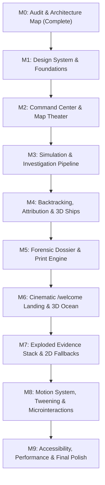

# OilGuard Frontend Rebuild: Master Implementation Plan

Generated during Milestone M0 Audit.
Defines the sequential milestones (M1 through M9) to transform OilGuard into an industry-grade maritime intelligence product.

---

## 1. Rebuild Principles & Execution Guardrails

1. **One Milestone at a Time**: Complete all deliverables for the active milestone, run full verification, write the milestone report, and wait for explicit user approval before proceeding to the next.
2. **Never Touch Protected Contracts**: Backend APIs, Zustand store structures, WebSocket topics, and stage sequences are invariant (see `PROTECTED_CONTRACTS.md`).
3. **No Fabricated Data / Clear Provenance**: Every metric, coordinate, vessel, and detection must display honest provenance: **Live**, **Controlled** (demo scenario), **Simulated**, **No data**, **Unavailable**, **Awaiting acquisition**, or **Not yet calculated**.
4. **Instrument at Sea Aesthetic**: Nautical graticule frame with live viewport coordinates, restrained deep-sea tonal layering (`abyss`, `trench`, `deck`), subtle sonar accent, self-hosted fonts (Schibsted Grotesk, Newsreader, JetBrains Mono), and iridescent thin-film gradient reserved exclusively for oil sheen.
5. **Real Browser Validation at Every Step**: Validate builds with TypeScript checks and headless browser verification at 4 canonical breakpoints: 1920×1080, 1440×900, 1280×800, and 768px wide. Save screenshot artifacts to `docs/frontend-rebuild/screenshots/M<n>/`.
6. **Anti-Generic Self-Critique**: End every milestone by auditing against the MASTER_BRIEF §6.5 avoid-list (no card-in-card nesting, no purple AI glows, no gratuitous chips, no monospace labels, no decorative radar sweeps).

---

## 2. Milestone Roadmap (M1 to M9)

---

### Milestone M1: Design System & Foundations
- **Objective**: Establish the core design system tokens, typography, primitives, and base layout shell.
- **Skills to Apply**: `frontend-design`, `ui-ux-pro-max`, `hierarchy`, `depth`.
- **Dependencies Installed (targeted for M1-M2 only)**:
  - Tailwind CSS v4 (`@tailwindcss/vite`)
  - Primitives: `clsx`, `tailwind-merge`, `class-variance-authority`, `@radix-ui/react-tooltip`, `@radix-ui/react-dialog`, `@radix-ui/react-separator`, `lucide-react`
  - Fonts: `@fontsource-variable/schibsted-grotesk`, `@fontsource-variable/newsreader`, `@fontsource-variable/jetbrains-mono`
  - Toasts: `sonner`
- **Deliverables**:
  - `docs/frontend-rebuild/DESIGN_PLAN.md`: Full design specifications, token mappings, font hierarchy, and ASCII layout wireframes.
  - `src/ui/design-system/`: Theme tokens, typography classes, base primitives (Button, Panel, Sheet, Badge, StatusChip, Tooltip).
  - Coexistence verification: Tailwind v4 stylesheet coexisting seamlessly with MapLibre GL and Deck.gl canvas CSS.
  - Base application shell layout in `src/ui/shell/AppShell.tsx`.
- **Legacy Files Retired**: `src/index.css` (legacy 125KB replaced by clean Tailwind stylesheet), `src/styles/vsco.ts`, `src/components/ui/Button.tsx`, `src/components/ui/Panel.tsx`, `src/components/ui/primitives.tsx`, `src/components/Status.tsx`.
- **Verification**: `npm run build`, TypeScript check, font loading verification, zero CSS layout collision with map container.

---

### Milestone M2: Command Center & Map Theater
- **Objective**: Build the primary operational workspace (`/`) with a map-first theater, live graticule frame, command spine, operational telemetry bar, flightpath rail, layer drawer, and contextual console.
- **Skills to Apply**: `frontend-design`, `arrange`, `hierarchy`, `distill`, `animate`, `critique`.
- **Dependencies Installed**:
  - `cmdk` (Command Palette, Ctrl/Cmd+K)
  - `react-resizable-panels` (Collapsible responsive side panels)
  - `motion` (import from `motion/react` for panel enter/exit and layout animations)
- **Deliverables**:
  - `src/ui/shell/CommandSpine.tsx`: Ultra-slim vertical operational rail with brand glyph, route shortcuts, UTC Zulu clock, and service health cluster.
  - `src/ui/shell/OperationalBar.tsx`: Top telemetry bar with active case ID, simulation status, provenance chips, and Quick Command trigger.
  - `src/ui/console/map/GraticuleFrame.tsx`: Precision nautical chart border overlaying the map with real viewport latitude/longitude markings that update during pan/zoom.
  - `src/ui/console/FlightpathRail.tsx`: Interactive horizontal or docked progression bar for the 8 forensic stages.
  - `src/ui/console/LayerDrawer.tsx`: Collapsible drawer with grouping (Observation, Simulation, Environment, Analysis), legend swatches, and empty-state explanations.
  - `src/ui/console/ContextualConsole.tsx` & `SelectionInspector.tsx`: Dynamic right panel updating based on selected map object or active stage.
  - `src/ui/pages/CommandCenterPage.tsx`: Integrated `/` command center page.
- **Legacy Files Retired**: `src/pages/CommandCenter.tsx`, `src/components/Layout.tsx`, `src/components/commandcenter/*`, `src/components/workspace/*`, `src/components/intel/*`.
- **Verification**: Browser QA at 1920x1080, 1440x900, 1280x800, 768px. Pan and zoom map, test graticule coordinates against map center, verify layer toggles.

---

### Milestone M3: Simulation & Investigation Pages
- **Objective**: Rebuild the scenario control room (`/simulation`) and the stage-by-stage evidence workspace (`/investigation`).
- **Skills to Apply**: `arrange`, `hierarchy`, `data-viz`, `animate`, `critique`.
- **Dependencies Installed**: None additional (utilizing M1-M2 primitives).
- **Deliverables**:
  - `src/ui/pages/SimulationPage.tsx`: Fleet management, scenario creator, manual vessel repositioning, spill release controls, and forward drift runner with an honest empty state when no scenario is active.
  - `src/ui/console/simulation/TimeScrubber.tsx`: Interactive time scrubber with play/pause and step controls.
  - `src/ui/pages/InvestigationPage.tsx`: Dedicated 8-stage workspace with progress gauge, execution controls (start, retry, cancel), stage details, and forensic evidence card deck.
  - `src/ui/console/investigation/StageCards.tsx`: Evidence cards for Detection (SAR polygons), Characterization, Environment, Drift, Backtracking, AIS, Attribution, and Conclusion.
  - Ground-truth evaluation modal/card with reveal metrics comparison.
- **Legacy Files Retired**: `src/pages/Simulation.tsx`, `src/pages/Investigation.tsx`, `src/components/investigation/*`.
- **Verification**: Trigger simulation lifecycle, advance time, release spill, run investigation pipeline, verify live WebSocket event updates.

---

### Milestone M4: Backtracking & Attribution Pages
- **Objective**: Rebuild the inverse drift workspace (`/backtracking`) and the candidate attribution ranking room (`/attribution`) with 3D vessel inspector.
- **Skills to Apply**: `data-viz`, `imagery`, `threejs-fundamentals`, `animate`, `critique`.
- **Dependencies Installed**:
  - `@tanstack/react-table` (Virtualized forensic candidate table)
  - `three`, `@react-three/fiber` (v9 for React 19), `@react-three/drei` (Lazy-loaded for vessel inspection)
  - `d3-scale`, `d3-shape` (Custom SVG chart components)
- **Deliverables**:
  - `src/ui/pages/BacktrackingPage.tsx`: Inverse Lagrangian ensemble visualization, source region polygon, 50/75/90% confidence contours, origin time window, and uncertainty indicators.
  - `src/ui/pages/AttributionPage.tsx`: Virtualized candidate ranking table with 5-factor forensic score breakdown bars (spatial, temporal, trajectory, anomaly, environmental).
  - `src/ui/console/attribution/VesselInspector.tsx`: Detailed candidate telemetry, closest approach metrics, AIS timeline gaps.
  - `src/ui/three/RepresentativeShipViewer.tsx`: Lazy-loaded 3D representative vessel viewer by type (tanker, container, cargo, fishing) with mandatory disclaimer: *"Representative model, not vessel-specific geometry"*.
  - Ship silhouette markers for Deck.gl rotated by heading.
- **Legacy Files Retired**: `src/pages/Backtracking.tsx`, `src/pages/Attribution.tsx`, `src/components/backtracking/*`, `src/components/attribution/*`.
- **Verification**: Run backtracking, verify confidence contours, run attribution, test candidate table sorting, verify 3D ship viewer renders properly.

---

### Milestone M5: Forensic Incident Dossier & Report Engine
- **Objective**: Build a publication-grade, scroll-driven forensic incident dossier (`/report`) with print-ready styling.
- **Skills to Apply**: `frontend-design`, `hierarchy`, `data-viz`, `polish`.
- **Dependencies Installed**: None additional.
- **Deliverables**:
  - `src/ui/pages/ReportPage.tsx`: Formal investigative report formatted with Newsreader typography, sticky section index, and quiet evidence reveals.
  - Mandatory report sections: Executive Summary, Incident Context, SAR Detection, Slick Characterization, Metocean Environment, Forward Drift, Backtracking Ensemble, AIS Trajectory Analysis, Multi-Factor Attribution Ranking, Attributable Vessel Finding, and Methodological Limitations & Uncertainties.
  - Data provenance footnotes on every chart and table.
  - Print stylesheet (`@media print`) that formats the dossier into an unclipped, high-contrast, multi-page PDF document without web furniture.
- **Legacy Files Retired**: `src/pages/Report.tsx`.
- **Verification**: Review dossier in browser, test browser Print to PDF preview, ensure no truncated content, page breaks fall cleanly between sections.

---

### Milestone M6: Cinematic Welcome Landing & 3D Ocean Scene
- **Objective**: Create the new `/welcome` cinematic landing page featuring a real-time 3D ocean, slowly rocking tanker, iridescent oil-sheen shader, and pinned scroll narrative.
- **Skills to Apply**: `frontend-design`, `threejs-fundamentals`, `threejs-shaders`, `threejs-animation`, `animate`, `imagery`.
- **Dependencies Installed**:
  - `gsap`, `@gsap/react`, `ScrollTrigger`
  - `lenis` (Smooth scrolling enabled only on `/welcome` and `/report`)
  - `vite-plugin-glsl` (Optional custom GLSL loader)
- **Deliverables**:
  - `src/ui/pages/WelcomePage.tsx`: Pinned 3D scroll story guiding the user from satellite detection to vessel attribution.
  - `src/ui/three/OceanScene.tsx`: Real-time ocean surface with custom Gerstner-wave GLSL vertex/fragment shaders with fresnel and foam.
  - `src/ui/three/OilSheenMaterial.ts`: Thin-film iridescent gradient shader material applied strictly to the oil slick.
  - `src/ui/three/TankerModel.tsx`: Procedural or CC0 tanker model rocking with wave dynamics and trailing a faint wake.
  - 2D accessible fallback when WebGL is unavailable or user has `prefers-reduced-motion` enabled.
- **Verification**: Verify 60fps rendering, smooth scroll narrative, camera transitions, and CTA link to `/`.

---

### Milestone M7: Exploded Evidence Stack
- **Objective**: Build the 9-layer exploded evidence stack ("explosive images") in both `/welcome` (cinematic scroll) and `/investigation` (interactive exploration mode), with a 2D fallback.
- **Skills to Apply**: `threejs-interaction`, `threejs-animation`, `threejs-shaders`, `data-viz`, `depth`.
- **Dependencies Installed**: None additional.
- **Deliverables**:
  - `src/ui/three/ExplodedEvidenceStack.tsx`: 9 distinct layered surfaces arranged along the Z-axis:
    1. Satellite/SAR scene
    2. Oil slick mask (iridescent sheen shader)
    3. Wind field
    4. Ocean currents
    5. Forward drift
    6. Backtracking ensemble
    7. AIS vessel tracks
    8. Probable source region
    9. Attribution marker
  - Three distinct modes: **Stacked** (composite), **Exploded** (separated in 3D with leader lines and provenance tags), and **Converged** (converging onto the identified vessel).
  - In `/investigation`: Driven by real store data with "No data" tags where uncalculated.
  - In `/welcome`: Driven by scroll progress with illustrative labels.
  - `src/ui/console/investigation/ExplodedEvidence2DFallback.tsx`: High-contrast annotated SVG/CSS-3D stack for low-power devices and reduced motion.
- **Verification**: Test layer separation, leader-line alignment, interactive rotation, data fidelity in investigation mode.

---

### Milestone M8: Motion System Polish & Microinteractions
- **Objective**: Unify motion tokens, shared-element route transitions, flightpath state transitions, and tabular number tweening.
- **Skills to Apply**: `animate`, `polish`, `critique`.
- **Dependencies Installed**: None additional.
- **Deliverables**:
  - `src/ui/motion/`: Standardized timing tokens (micro 100-150ms, UI 180-280ms, layout 300-500ms, cinematic 500-1200ms) and physics springs.
  - Number tweening component (`NumberTween.tsx`) for scores, areas, coordinates, and countdowns.
  - View Transitions API integration for route navigation with Framer Motion fallbacks.
  - Strict compliance with `prefers-reduced-motion`: all transforms, wave loops, and transitions gracefully disable or reduce to subtle opacity crossfades.
- **Verification**: Verify no layout jank or frame drops; toggle OS reduced-motion setting and confirm all motion disables immediately.

---

### Milestone M9: Quality, Accessibility, Performance & Documentation
- **Objective**: Complete end-to-end quality audit, WCAG 2.2 AA accessibility verification, bundle optimization, and documentation.
- **Skills to Apply**: `web-design-guidelines`, `polish`, `critique`.
- **Dependencies Installed**:
  - `@axe-core/playwright` / vitest accessibility test utilities
- **Deliverables**:
  - Accessibility QA: Full keyboard navigation (focus rings, skip links, ARIA roles on custom sliders and drawers, contrast check pass on all text).
  - Performance audit: Code-splitting for Three.js and GSAP bundles; initial console bundle within limits; dynamic import verification.
  - Update `README.md` with product architecture, new screenshots, and design system documentation.
  - Update `docs/frontend-rebuild/PROGRESS.md` with final project summary.
- **Verification**: `npm run build`, bundle size reporting, clean browser console across all pages, passing accessibility audit.

---

## 3. Definition of Done Checklist

- [ ] Product matches "Instrument at sea" aesthetic and looks like a commercial maritime intelligence platform.
- [ ] Map remains the primary operational surface in Command Center.
- [ ] Every protected route (`/`, `/simulation`, `/investigation`, `/backtracking`, `/attribution`, `/report`) and `/welcome` functions properly.
- [ ] All protected API and store contracts remain intact without duplicate state.
- [ ] 3D scenes are lazy-loaded, run smoothly, and include accessible 2D fallbacks.
- [ ] No fabricated data; provenance is explicitly labeled on all data points.
- [ ] Zero lint, TypeScript, or console errors.
- [ ] Responsive layouts verified at 1920, 1440, 1280, and 768px breakpoints.
